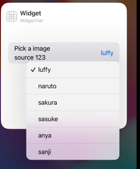

# Overview and Practice 

# I. Overview

Ở phần này ta sẽ ôn lại tổng quát lý thuyết `Widget`. Đây là phần khởi tạo 1 `Widget`:


```swift
struct WidgetLuffy: Widget {
    let kind: String = "WidgetLuffy"

    var body: some WidgetConfiguration {
        AppIntentConfiguration(kind: kind, 
                               intent: ConfigurationAppIntent.self,
                               provider: Provider()) { entry in
            WidgetLuffyEntryView(entry: entry)
                .containerBackground(.fill.tertiary, for: .widget)
        }
        .contentMarginsDisabled()
    }
}


```

Ở đây ta có các thành phần quan trọng sau:
- `intent`: Đây là 1 struct comform với protocol `WidgetConfigurationIntent`, có nhiệm vụ chính là cung cấp các action cho phần `EditWidget`
- `Provider`: Đây là 1 struct comform với protocol `AppIntentTimelineProvider`, có nhiệm vụ chính là cung cấp `timeline` và dữ liệu `entry` tới `View`. Bên cạnh đó, nó cũng sẽ được sử dụng để khi `edit intent`, mỗi khi `edit widget`, nó sẽ gọi method `timeline` của `provider`.

# II. Intent

Như đã nói `intent`: Đây là 1 struct comform với protocol `WidgetConfigurationIntent`, có nhiệm vụ chính là cung cấp các action cho phần `EditWidget`. Ta sử dụng thằng `AppIntent` hầu như cho việc `Edit Widget`.

```swift
struct ConfigurationAppIntent: WidgetConfigurationIntent {
    static var title: LocalizedStringResource = "Configuration"
    static var description = IntentDescription("This is an example widget.")


    @Parameter(title: "Pick a imagesource")
    var image: ImageSource
}

struct Provider: AppIntentTimelineProvider {
    func timeline(for configuration: ConfigurationAppIntent, in context: Context) async -> Timeline<GameStatusEntry> {}
}
```

Ta thấy method `timeline` có 1 biến `configuration` thuộc kiểu `ConfigurationAppIntent`, nó chính là thằng `Intent` ta đang nói đến. Trong `Intent`, ta đã khai báo 1 kiểu dữ liệu mới đó là `ImageSource` comform với `AppEntity` (nhớ rằng với các kiểu dữ liệu ta custom cần phải được comform với `AppEntity`). Lúc này thằng `image thuộc kiểu imageSource` sẽ là thằng ta sử dụng để show thông tin với người dùng và cho phép người dùng edit.

```swift
struct ImageSource: AppEntity {
    
    var id: String
    
    static var defaultQuery: ImageQuery = ImageQuery()   //EntityQuery
        
    var image: ImageType
    
    static var allImage: [ImageSource] {
        ImageType.allCases.map { image in
            return ImageSource(id: image.rawValue, image: image)
        }
    }
    
    static var typeDisplayRepresentation: TypeDisplayRepresentation = "Image Viet"
    
    var displayRepresentation: DisplayRepresentation {
        DisplayRepresentation(title: "\(id)")
    }
}
```  

Trong phần `ImageSource`, ta có khai báo `static var defaultQuery: ImageQuery = ImageQuery()`, bây giờ ta cần chú ý đến phàn `ImageQuery`:

```swift
struct ImageQuery: EntityQuery {
    
    func entities(for identifiers: [ImageSource.ID]) async throws -> [ImageSource] {
        return ImageSource.allImage.filter { imageSource in
            return identifiers.contains(imageSource.id)
        }
        
    }
    
    func suggestedEntities() async throws -> [ImageSource] {
        ImageType.allCases.map { image in
            return ImageSource(id: image.rawValue, image: .luffy)
        }
    }
    
    func defaultResult() async -> ImageSource? {
        try? await suggestedEntities().first
    }
}
```

Ở đây ta sẽ chú ý rằng có 3 hàm: `- Quan trọng đấy nhớ đọc kĩ`
- `suggestedEntities`: Thằng này sẽ suggest tất cả giá trị cho user khi edit, nhìn ảnh dưới đây, vì `ImageType` có 6 `case`  nên nó sẽ có suggest 6 thực thể.



- `defaultResult`: Nó sẽ return default, cái này thi ko cần quan tâm
- `entities`: Hiện tại thì khi ta nhấn vào các option suggest, nó trả về cho ta duy nhất 1 `ID` mà tương ứng với option ta nhấn vào. Nhiệm vụ của ta là return cho nó 1 mảng Object mà trong mảng đó có phần tử có ID trùng với ID `entities` nó truyền vào là được.

```swift
struct ImageQuery: EntityQuery {
    
    func entities(for identifiers: [ImageSource.ID]) async throws -> [ImageSource] {
        print("DEBUG: \(identifiers.first?.entityIdentifierString) and \(identifiers.count)")
//        identifiers.forEach { id in
//            print("DEBUG: \(id) siuu")
//        }
//        `
        var a = ImageSource.allImage.filter { imageSource in
            return identifiers.contains(imageSource.id)
        }
//        
//        print("DEBUG: \(a.count) and \(a.first?.id)")
        return [ImageSource(id: ImageType.anya.rawValue, image: .luffy), ImageSource(id: ImageType.sasuke.rawValue, image: .sasuke)]
        return a
//        return ImageSource.allImage
    }
    
    func suggestedEntities() async throws -> [ImageSource] {
        ImageType.allCases.map { image in
            return ImageSource(id: image.rawValue, image: image)
        }
    }
    
    func defaultResult() async -> ImageSource? {
        try? await suggestedEntities().first
    }
}
```

- Đầu tiên ta thấy hàm `suggestedEntities` show cho user các lựa chọn, tên của các lựa chọn đó được hiển thị thông qua thuộc tính `displayRepresentation` của `imageSource`, ở đây ta sẽ hiển thị các lựa chọn thông qua `id`.

```swift
var displayRepresentation: DisplayRepresentation {
    DisplayRepresentation(title: "\(id)")
}
```

- Thứ 2, ta phải hiển rằng cái quan trọng ở đây là `id`, những cái khác ko quan trọng ok. Vẫn ở `suggestedEntities`, ta return lại tập hợp các giá trị của `ImageSource` và hiển thị lựa chọn. Cái này thì ko đáng nói, cái đáng nói ở đây là cái gì thực sự được hiển thị. Cái được hiển thị ở đây là `displayRepresentation`, và `displayRepresentation` được đính với `id` ta truyền cho nó khi khởi tạo Object `ImageSource`. Lúc này tương ứng với mỗi `displayRepresentation` được đính với `id`, các thuộc tính khác như `image` hay `qq` nó chỉ là rác, ta khởi tạo nó để return thôi.
- Thứ 3, khi user tích vào option hiển thị (`từ bước 2 ta thấy rằng mỗi option đã đính với 1 id`), thì khi user tích vào option đó, thì tương ứng với việc ta sẽ pass `id` đó vào hàm `entities`, `nhiệm vụ lúc này của ta, là return lại 1 mảng đối tượng ImageSource, trong đó có 1 đối tượng có id trùng với id mà entities pass vào là được`. 
- Thứ 4, sau khi ta return lại 1 mảng `imageSource`, lúc này khi user thoát ra phần `edit Widget`, `Widget` sẽ tự động được render lại và nó sẽ gọi tới hàm `timeline` của `Provider`, lúc này ta sẽ lấy `imageSource` mới từ parameter `configuration` thuộc kiểu `ConfigurationAppIntent`.


# III. AppIntent - Interact Button with Widget

Để cho user tương tác được với view trên widget, ta được Apple cung cấp `Button(intent: <AppIntent>, label: <View>)`. Ở đây ta cần truyền 1 struct comforn với kiểu `AppIntent`. Ở `AppIntent` ta sẽ triển khai function `perform`, mỗi khi người dùng click vào Button, hệ thống sẽ gọi tới function `perform`. Nhiệm vụ chính của ta là triển khai function `perform()` cho thích hợp.

```swift
struct ToggleStateIntent: AppIntent {
    
    init() {
        
    }
    
    static var title: LocalizedStringResource = "Toggle Task Stage"
    
    @Parameter(title: "Task ID")
    var id: String
    
    init(id: String) {
        self.id = id
    }
    
    func perform() async throws -> some IntentResult & ReturnsValue {
        if let index = TaskDataModel.shared.task.firstIndex(where: { task in
            return task.id == self.id
        }) {
            TaskDataModel.shared.task[index].completed.toggle()
        }
        
        
        
        return .result()
    }
}

Button(intent: ToggleStateIntent(id: task.id)) {
    Image(systemName: task.completed ? "checkmark.circle.fill" : "circle")
        .foregroundColor(.blue)
}
```