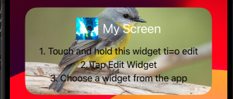
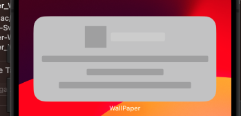
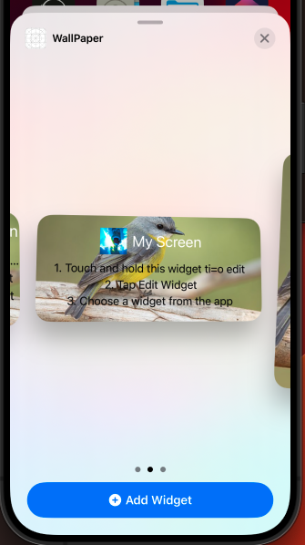

# Luồng chương trình Widgets

# I. Edit Widget

```swift
struct ConfigurationAppIntent: WidgetConfigurationIntent {
    static var title: LocalizedStringResource = "Configuration"
    static var description = IntentDescription("This is an example widget.")

    @Parameter(title: "Pick a image")
    var imageSrc: ImageSource
}
```

Để hiển thị view trên `Widget`, ta cần quan tâm 2 điều đó là `id` và function `entities` của `EntitQuery hoặc EntityStringQuery`. Để làm rõ 2 vấn đề này ta đi vào 2 hàm `suggestedEntites` và `defaultResult` của `EntityQuery`.

- `defaultResult`: Đây là function trả về 1 kiểu dữ liệu `ImageSource`, kiểu dữ liệu này có 1 propery là `ID`. OK ta bắt đầu làm quen với `ID`. `defaultResult` là function có trách nhiệm return lại default view cho Widget, nào hãy nhìn ảnh bên dưới:


Bạn thấy không, đây view của `Widget` mặc định khi được add từ `Galery`. Mỗi khi ta add `Widget` của `Gallery Widget`, thì `WidgetKit` sẽ gọi tới hàm `defaultResult` để lấy thông tin

```swift
    func defaultResult() async -> ImageSource? {
        print("DEBUG: goto defaultResult")
//        return try? await suggestedEntities().first
       return ImageSource(id: "choose", name: "fgdsajkhfgskdjh")
    }
```

Nào hãy đi vào vấn đề chính, bạn đã thấy thuộc tính `ID` của `ImageSource` trong đoạn code trên chưa, tôi đặt nó là `choose` vì muốn lần đầu tiên user `edit widget` sẽ show title là `choose` và thuộc tính `name` tôi đặt nó là 1 cái gì đó rất là rác rưởi. Tại sao thuộc tính `name` tôi lại gán cho nó 1 giá trị rác, bởi vì ngoài `ID`, các thuộc tính khác ko quan trọng. 

- Bây giờ ta đi sẽ đi vào func `entities` của `EntityQuery`: Bạn phải biết là `entities` là thằng quyết định xem `widget's view` có được render hay không. 

```swift
func entities(for identifiers: [ImageSource.ID]) async throws -> [ImageSource] {
    print("DEBUG: goto entities \(String(describing: identifiers.first))")
    return [ImageSource(id: "bird", name: "bird")]
}	
```

Ngay ở bên trên ta có function `defaultResult` return lại 1 đối tượng `ImageSource` có property là `ID`. Lúc này `ID` đó sẽ được pass vào trong function `entities` như là 1 `parameter`. Lúc này function `entities` sẽ return lại 1 mảng `ImageSource`, `Widget` sẽ check xem mảng `entities` trả về có đối tượng nào có `ID` mà pass vào hay không, nếu có nó sẽ tiến hành call tới hàm `timeline` của `Provider` để rerender lại view widget. Giá trị `ImageSource` trong `ConfigurationAppIntent` sẽ là đối tượng có `ID` trùng với `ID` truyền vào `entities`. Lúc này `timeline` sẽ sử dụng `ImageSource` mới để render view widget.

| Với trường hợp return lại mảng có ID | Với trường hợp return lại mảng ko có ID |
| :--------: | :--------: | 
|  |  | 

- Hiển thị trên `gallery widget`, này cũng được gọi là hiển thị trên `defaultResult`.



- Việc tương tự cũng áp dụng cho `edit Widget`, ta sử dụng hàm `suggestedEntities` của `EntityQuery` để return lại `ID` ta chọn.

```swift
func suggestedEntities() async throws -> [ImageSource] {
    print("DEBUG: goto suggestedEntities")
    return [ImageSource(id: "chose", name: "fdsfdsf"), ImageSource(id: "anime", name: "fsdfsd")]
}
```

Ở đây ta return lại mảng 2 đối tượng của `ImageSource`, điều đó đồng nghĩa với việc ta sẽ suggest 2 lựa chọn cho user, ta cũng thấy thêm, thuộc tính `name` là 1 giá trị rác, bởi vì đã nói các giá properties với `suggestedEntities` không quan trọng vì ta sẽ không sử dụng. Cái mà ta sẽ sử dụng là đối tượng có `ID` trùng với `ID` ta pass vào trong `entities`. 


# II. Button Intent

Mỗi khi nhấn vào `Button(intent:)`, lần lượt các func sẽ vào là:

```terminal
DEBUG: goto defaultResult
DEBUG: goto perform
DEBUG: goto entities Optional("catfish")
DEBUG: goto timeline
```