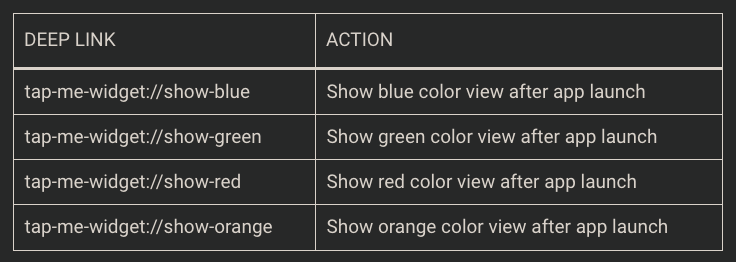

# Handle Tap Gestures on Widgets

Khi ta tương tác với widgets, chúng ta thấy rằng nó có 1 default behavior khi tap, đó là lauch the host app. Tuy nhiên, ta có thể custom hành động này thông qua widget configuration.

Điều đáng nói là không phải mọi component của `SwiftUI` đều hoạt động tốt như mong muốn trong `Widget`. Ví dụ như `Buttons` không còn hoạt động và `Links` chỉ work dưới 1 điều kiện nào đó.

# I. How Do Tap Gestures Work on Widgets?

Mặc dù `widgets` thực chất là các `SwiftUI view`, tuy nhiên các views đó thường hoạt động kì lạ khi xử lý `tap gestures`. Khi `widget detects taps`, nó sẽ lauch host app, hành động này không thể thay đổi được. Tuy nhiên, chúng ta có thể custom những gì sẽ xảy ra khi app lauchs, ` in a similar way to how we use deep links to customize app actions after launch.`

Có những điều kì lạ ta cần biết:
- `SwiftUI Button` does not work on widgets
- SwiftUI Link is supported on the systemMedium and systemLarge widget families
- SwiftUI Link is not supported on the systemSmall widget families.

# II. Handling Tap Gestures on Widgets

## 2.1 The ‘Tap Me’ Widget

Đã nhắc ở phần trước, `tapping on a widget is just like tapping on a deep link`. Vì vậy, ta cần desgin deep links tương ứng với mỗi navigation action:

# V. Reference

1. [How to Handle Tap Gestures on Widgets?](https://swiftsenpai.com/development/widget-tap-gestures/?fbclid=IwAR2mHmqx7A5ecNio-vqI-jLwaSDhzF8eSE1xl0_TzzSSno51SHbi4XgsqbU)