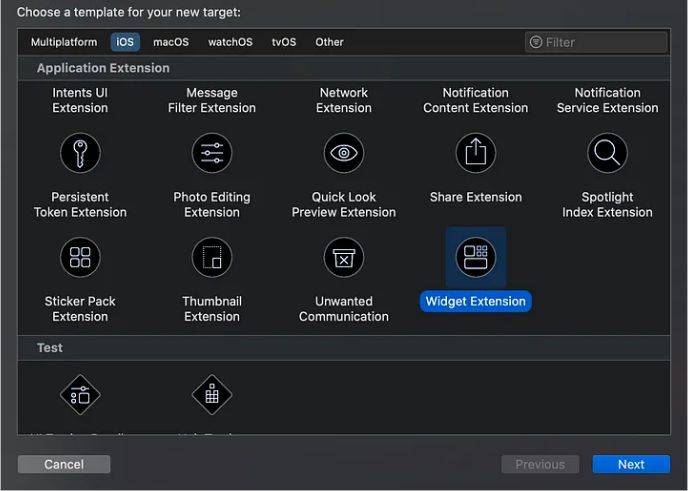

# Widget

# I. Initiate widget extension

This is done easily by following `File > New > Target`, search and select Widget Extension.




`Widget extension template` cung cấp cho ta `initial implementation` mà comform với `Widget` protocol. Phần `widget'body` quyết định loại nội dung mà `widget` sẽ hiển thị. `Widget` sử dụng 3 loại configures bao gồm:
- `AppIntentConfiguration`: Cho phép user custom việc thị như `weather widget` mà cần zip or postal code cho city.
- `ActivityConfiguration`: được sử dụng cho việc hiển thị live data
- [StaticConfiguration](https://developer.apple.com/documentation/widgetkit/staticconfiguration)

<a name="detail-configure"></a>

```swift
struct GameStatusWidget: Widget {
    var body: some WidgetConfiguration {
        StaticConfiguration(
            kind: "com.mygame.game-status",
            provider: GameStatusProvider(),
        ) { entry in
            GameStatusView(entry.gameStatus)
        }
        .configurationDisplayName("Game Status")
        .description("Shows an overview of your game status")
        .supportedFamilies([.systemSmall])
    }
}
```

## 1.1 Add configure details

Để cấu hình `static widget`, ta cần cung cấp các thông tin sau:

- `kind`: Đây chỉ là chuỗi được sử dụng để identifies, đây là 1 chuối bất kì, xem ảnh bên trên
- `provider`: Là một Object mà conform với [TimelineProvider](https://developer.apple.com/documentation/widgetkit/timelineprovider) để cung cấp `timeline` cho `widget` biết rằng khi nào thì render widget. `Timeline` là 1 chuỗi liên tục chứa 1 custom [TimelineEntry](https://developer.apple.com/documentation/widgetkit/timelineentry) ta define.
. `Entry` là một sequence xác định thời gian ta muốn `WidgetKit` update `Widget's content` và các thuộc tính mà ta sử dụng để render `widget's view`.
- `content`: Là một closure mà chứa `SwiftUI views`. `WidgetKit` invokes this to render the widget’s content, passing a `TimelineEntry` parameter from the provider.

## 1.2 Provide timeline entries

Như đã nói `timeline` sẽ cung cấp một sequance `timeline entries`. Mỗi `entry` chỉ định ngày và giờ để cập nhật nội dung của `widget` và bao gồm dữ liệu mà `widget` cần để hiển thị chế độ xem của nó. Dưới là ví dụ về `game-status widget` mà define `timeline entry`: 

```swift
struct GameStatusEntry: TimelineEntry {
    var date: Date
    var gameStatus: String
}
```

`WidgetKit` sẽ gọi `getTimeline(in:completion:)` để reuqest 1 `timeline` từ `provider`. `Timeline` chứa 1 hoặc nhiều `Timeline entrys` và 1 reload policy mà thông báo cho widgets khi nào cần request tiếp `timeline`.

- Ví dụ dưới đây trình bày làm thế nào `game-status widget's provider` generates ra timeline mà bao gồm 1 entry với current game status từ server, và 1 reload policy mà yêu cầu 1 timeline mới trong 15p:

```swift
struct GameStatusProvider: TimelineProvider {
    func getTimeline(in context: Context, completion: @escaping (Timeline<GameStatusEntry>) -> Void) {
        // Create a timeline entry for "now."
        let date = Date()
        let entry = GameStatusEntry(
            date: date,
            gameStatus: gameStatusFromServer
        )


        // Create a date that's 15 minutes in the future.
        let nextUpdateDate = Calendar.current.date(byAdding: .minute, value: 15, to: date)!


        // Create the timeline with the entry and a reload policy with the date
        // for the next update.
        let timeline = Timeline(
            entries:[entry],
            policy: .after(nextUpdateDate)
        )

        // Call the completion to pass the timeline to WidgetKit.
        completion(timeline)
    }
}
```

## 1.3 Generate a preview for the widget gallery

Để user có thể sử dụng widget của mình, thì `widget` phải có sẵn trong `widget gallery`. Để show widget của mình trong widget gallery, `WidgetKit` sẽ yêu cầu `provider` một `preview snapshot` để có thể hiển thị generic data. Để làm được điều đó, `Widget` sẽ gọi method `getSnapshot(in:completion:)` của `provider` với parameter `isPreview` được set là true. Ví dụ dưới đây `game-status widget’s provider` sẽ implements phương thức `getSanpShot` để show status nếu nó available, hoặc phản hồi empty status nếu chưa có status từ serve:

```swift
struct GameStatusProvider: TimelineProvider {
    var hasFetchedGameStatus: Bool
    var gameStatusFromServer: String


    func getSnapshot(in context: Context, completion: @escaping (Entry) -> Void) {
        let date = Date()
        let entry: GameStatusEntry

        if context.isPreview && !hasFetchedGameStatus {
            entry = GameStatusEntry(date: date, gameStatus: "—")
        } else {
            entry = GameStatusEntry(date: date, gameStatus: gameStatusFromServer)
        }
        completion(entry)
    }
```

## 1.4 Display content in your widget

`Widgets` xác định nội dung của nó thông qua `SwiftUI`. Khi người dùng add widget của ta từ `widget gallery`, họ sẽ chọn 1 `family` nào đó như `small hoặc medium` mà được widget support. `Widget’s content closure` phải có khả năng render mỗi family mà widget support. `WidgetKit sets the corresponding family and additional properties, such as the color scheme (light or dark), in the SwiftUI environment.`

- Tiếp tục với ví dụ `game-status` trên, ta thấy rằng ở ví dụ <a href="detail-configure">detail configure</a>, phần `content closure` sử dụng 1 `GameStatusView` để hiển thị status. Và bởi vì `widget` chỉ support `.systemSmall family`,nên nó sẽ sử dụng 1 `GameTurnSummary swifutUI view` để hiển thị `game's current status`:

```swift
struct GameStatusView : View {
    @Environment(\.widgetFamily) var family: WidgetFamily
    var gameStatus: GameStatus
    var selectedCharacter: CharacterDetail


    @ViewBuilder
    var body: some View {
        switch family {
        case .systemSmall: GameTurnSummary(gameStatus)
        default: GameDetailsNotAvailable()
        }
    }
}
```

`In your widget, as you add more supported families to the widget’s configuration, you would add additional cases in the widget view’s body property for each additional family.`

## 1.5 Hide sensitive content

`Widget` có thể hiển thị các thông tin nhạy cảm và có thể được hightly visible. Để người dùng quyết định liệu rằng 1 `widget` nên hiển thị các thông tin nhạt cảm trên các `locked devide`, ta có thể đánh dấu views mà chứa các thông tin nhạy cảm đó là `privacySensitive(_:)` modifier. Với các ứng dụng IOS, người dùng có thể configure liệu rằng sẽ hiểnt thị các thông tin nhạy cảm đó trên lock screen và trong khi always on. `In Settings, they can deactivate data access for Lock Screen widgets in the ALLOW ACCESS WHEN LOCKED section of Settings > Face ID & Passcode`. 

- Nếu người dùng chọn hide privacy sensitive content, WidgetKit renders a placeholder or `redactions` you configure. Để configure `redactions`, ta sẽ triển khai `redacted(reason:)` callback.

Đây là 1 giải pháp để đánh dấu 1 view là `privay sensitive`. Ví dụ nếu toàn bộ widget content là privacy sensitive, ta sẽ thêm `Data Protection` vào `widget extension`. Cho đến khi người dùng unlock device để match với `privacy level` ta chọn,  `WidgetKit` sẽ hiển thị placehodler thay vì `widget content`. Đầu tiên ta cần enable `Data Protection capacbility` cho `widget extension` trong Xcide, sau đó set 
[Data Protection Entitlement](https://developer.apple.com/documentation/bundleresources/entitlements/com_apple_developer_default-data-protection)
 với level privacy ta mong muốn:
 - `NSFileProtectionComplete`: WidgetKit hides widget content when the device is locked. Additionally, iOS widgets aren’t available as iPhone widgets on Mac.
 - `NSFileProtectionCompleteUnlessOpen`: WidgetKit hides widget content when the device is passcode locked. Additionally, iOS widgets aren’t available as iPhone widgets on Mac.

## 1.6 Add dynamic content to your widgetin page link

`Widget` trước đây chỉ hỗ trợ hiển thị các thông tin chỉ đọc và không hỗ trợ các tính năng tương tác như `scrolling lists hoặc text input`. Tuy nhiên từ IOS17 và macOS 14, `widget` đã hỗ trợ vài tính năng tương tác và animation. Xem [Adding interactivity to widgets and Live Activities](https://developer.apple.com/documentation/widgetkit/adding-interactivity-to-widgets-and-live-activities) để thêm thông tin chi tiết.

## 1.7 Respond to user interaction

Dựa trên các tương tác vơí `widget` từ người dùng, hệ thống sẽ sử lý các tương tác đó. Widget có thể chỉ định 1 URk để thông báo tới app rằng `what content to display`. Cấu hình customs URls với widget:
- Với all widgets, thêm ` widgetURL(_:)` view modifier
Tạm bỏ

## 1.8 Preview widgets in Xcodein page link

Xcode allows you to look at previews of your widgets without running your app in Simulator or on a test device.

# V. Reference

1. [Widgets on iOS](https://medium.com/swlh/widgets-on-ios-e0156a2e7239)
2. [Widget Apple](https://developer.apple.com/documentation/widgetkit/creating-a-widget-extension/)