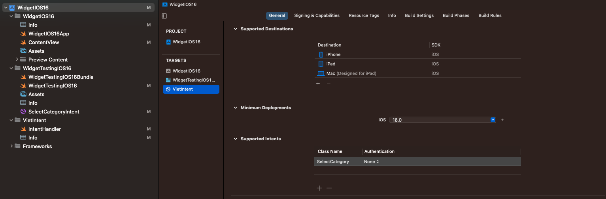

# Widget with API IOS 16

- Basic Init: Khi chưa sửa dụng đến AppIntent thì ta khai báo và sử dụng `StaticConfiguration`:

```swift
struct WidgetTestingIOS16: Widget {
    let kind: String = "WidgetTestingIOS16"

    var body: some WidgetConfiguration {
        StaticConfiguration(kind: kind, provider: Provider()) { entry in
           Static_WidgetEntryView(entry: entry)
               .frame(maxWidth: .infinity, maxHeight: .infinity)
               .background(Color.black)
       }
       .configurationDisplayName("My Widget")
       .description("This is an example widget.")
    }
}

```


- Tuy nhiên điều ta quan tâm ở đây là `Dynamic Widget Configuration`, nghĩa là người dùng có thể tương tác với widget và khai báo 1 list options widgets có thể sẽ được chọn. Ở đây ta sẽ sử dụng `Intent configuration`. Add File `SiriKit Intent Definition`, đặt tên file ở đây ví dụ là `ConfigureAppIntent`.

# I. Các bước Add Intent

## 1.1 Add file SiriKit Intent Definition File

Đầu tiên ta add thêm file `SiriKit Intent Definition File` bằng cách chọn `File > New File > SiriKit Intent Definition File` với đuôi là `.intentdefinition`. Sau đó ta addd thêm bằng `intent` bằng cách click `+ > New Intent`. Ở đây ta đặt tên `intent` là `SelectCategory`.


Sau khi có tạo mới một `Intent`, ta có thể thêm các `Parameter` để cho việc select option khi `Edit Widget`. Ở đây ta thêm 1 parameter và đặt tên là `vietName`. Ok về cơ bản là đã xong.


## 1.2 Adding an Intents Extension

Để cung cấp data dynamically, ta cần add một file `Intent Extensions` theo các bước sau đây:

- Select `File > New > Target > Intents extension` in Xcode's menu.
- Enter a name and select `none` for `Starting Point`.
- Choose `Activate` when Xcode prompts about activating the new scheme.
- Add the `intent` we created earlier in the Supported Intents section in the General tab of the extension's target.
- Ở phần `Supported Intent`, ta add thêm `SelectCategory Intent` như ở dưới.




- Make sure that the app, the widget extension and the Intents extension all include the `.intentdefinition` file in the `Target Membership` section.


## 1.3 Implementing an intent handler

Khi ta thêm `Intent extension`, `Xcode` đã tạo cho ta một file `IntentHandler.swift` cho ta, và khi. thêm `Supported Intent`, ta add thêm `SelectCategory Intent` như phần trên, hệ thống sẽ thêm cho ta một protocol `SelectCategoryIntentHandling`, và ở đây ta sẽ triển khai protocol đó:

```swift
struct WidgetTestingIOS16: Widget {
    let kind: String = "WidgetTestingIOS16"

    var body: some WidgetConfiguration {
        IntentConfiguration(kind: kind,
                              intent: SelectCategoryIntent.self,
                              provider: Provider(),
                              content: { entry in
                                WidgetTestingIOS16EntryView(entry: entry)
                                  .frame(maxWidth: .infinity, maxHeight: .infinity)
                                  .background(Color.white)
                              })
              .configurationDisplayName("My Widget")
              .description("This is an example widget.")
              .supportedFamilies([.systemSmall, .systemMedium, .systemLarge])
    }
}

class IntentHandler: INExtension, SelectCategoryIntentHandling {
    
    func provideVietNameOptionsCollection(for intent: SelectCategoryIntent, searchTerm: String?, with completion: @escaping (INObjectCollection<NSString>?, Error?) -> Void) {
        completion(INObjectCollection(items: ["place holder", "snapshot", "viet", "long", "duc anh"]), nil)
    }
   
    func resolveVietName(for intent: SelectCategoryIntent, with completion: @escaping (INStringResolutionResult) -> Void) {
        
    }

    override func handler(for intent: INIntent) -> Any {
        return self
    }

}
```

Ta thấy rằng ta phải comform 2 func đó là `provideVietNameOptionsCollection` và `resolveVietName` tương ứng với parameter `vietName`. Ta cũng hiểu ra rằng với mỗi parameter được thêm, ta sẽ phải comform 2 function tương ứng.

## 1.4 Hoàn tất 

```swift

struct Provider: IntentTimelineProvider {
    func placeholder(in context: Context) -> SimpleEntry {
        SimpleEntry(date: Date(), name: "place holder")
    }

    func getSnapshot(for configuration: SelectCategoryIntent, in context: Context, completion: @escaping (SimpleEntry) -> Void) {
        completion(SimpleEntry(date: Date(), name: "snapshot"))
    }
    
    func getTimeline(for configuration: SelectCategoryIntent, in context: Context, completion: @escaping (Timeline<SimpleEntry>) -> Void) {

        let entry = SimpleEntry(date: .now, name: configuration.vietName ?? "")
        

        completion(Timeline(entries: [entry], policy: .atEnd))
    }
}

struct SimpleEntry: TimelineEntry {
    let date: Date
    let name: String
}

struct WidgetTestingIOS16EntryView : View {
    var entry: Provider.Entry

    var body: some View {
        VStack {
            Text("Time:")
            Text(entry.date, style: .time)

            Text("Favorite Emoji:")
            Text(entry.name)
        }
    }
}
```


# V. Reference

1. [How to Integrate Siri Shortcuts and Design Custom Intents [Tutorial]](https://medium.com/simform-engineering/how-to-integrate-siri-shortcuts-and-design-custom-intents-tutorial-e53285b550cf)
2. [Widgets on iOS 16](https://medium.com/swlh/widgets-on-ios-e0156a2e7239)
3. [How to build a configurable widget with WidgetKit and SwiftUI](https://tanaschita.com/20220905-how-to-build-a-configurable-widget-with-widgetkit-and-swiftui/)