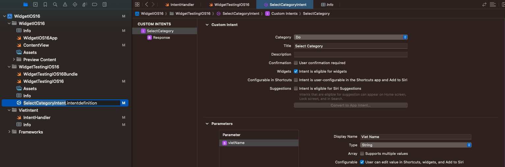

# Widget with API IOS 16

- Basic Init: Khi chưa sửa dụng đến AppIntent thì ta khai báo và sử dụng `StaticConfiguration`:

```swift
struct WidgetTestingIOS16: Widget {
    let kind: String = "WidgetTestingIOS16"

    var body: some WidgetConfiguration {
        StaticConfiguration(kind: kind, provider: Provider()) { entry in
           Static_WidgetEntryView(entry: entry)
               .frame(maxWidth: .infinity, maxHeight: .infinity)
               .background(Color.black)
       }
       .configurationDisplayName("My Widget")
       .description("This is an example widget.")
    }
}

```


- Tuy nhiên điều ta quan tâm ở đây là `Dynamic Widget Configuration`, nghĩa là người dùng có thể tương tác với widget và khai báo 1 list options widgets có thể sẽ được chọn. Ở đây ta sẽ sử dụng `Intent configuration`. Add File `SiriKit Intent Definition`, đặt tên file ở đây ví dụ là `ConfigureAppIntent`.

# I. Các bước Add Intent

## 1.1 Add file SiriKit Intent Definition File

Đầu tiên ta add thêm file `SiriKit Intent Definition File` bănghf cách chọn `File > New File > SiriKit Intent Definition File` với đuôi là `.intentdefinition`:


Từ đây ta có thể add thêm các loại parameter mà cho phép users customize widgets, `Parameters` có thể là:

- 1 Static list of choices: Sử dụng `New Enum`.
- gererated dynamic choices: Sử dụng `New Type`.




## 1.2 Adding an Intents Extension

Để cung cấp data dynamically, ta cần add một file `Intent Extensions` theo các bước sau đây:

- Select `File > New > Target > Intents extension` in Xcode's menu.
- Enter a name and select `none` for `Starting Point`.
- Choose `Activate` when Xcode prompts about activating the new scheme.
- Add the `intent` we created earlier in the Supported Intents section in the General tab of the extension's target.


- Make sure that the app, the widget extension and the Intents extension all include the `.intentdefinition` file in the `Target Membership` section.


## 1.3 Implementing an intent handler

Khi ta thêm `Intent extension`, `Xcode` đã tạo cho ta một file `IntentHandler.swift` cho ta


# V. Reference

1. [How to Integrate Siri Shortcuts and Design Custom Intents [Tutorial]](https://medium.com/simform-engineering/how-to-integrate-siri-shortcuts-and-design-custom-intents-tutorial-e53285b550cf)
2. [Widgets on iOS 16](https://medium.com/swlh/widgets-on-ios-e0156a2e7239)
3. [How to build a configurable widget with WidgetKit and SwiftUI](https://tanaschita.com/20220905-how-to-build-a-configurable-widget-with-widgetkit-and-swiftui/)